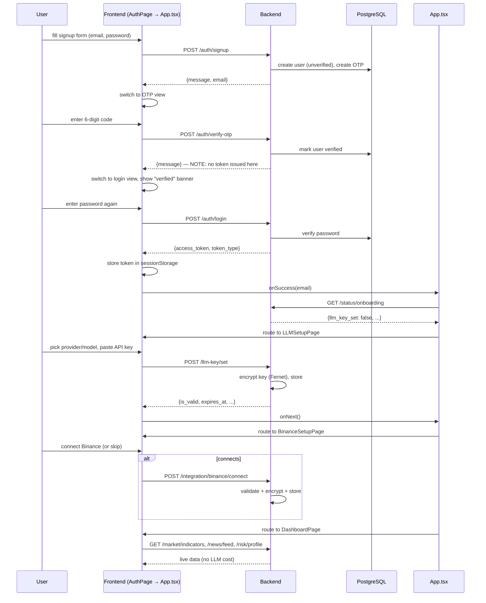
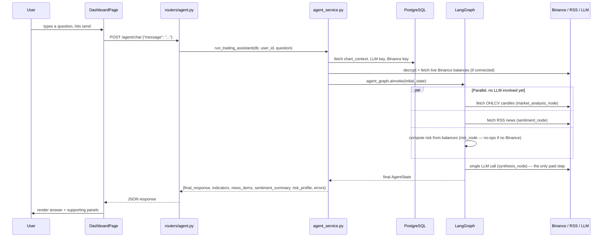

# Krypton — AI Crypto Trading Assistant

A full-stack app that pairs a FastAPI backend with a React/TypeScript frontend to deliver OTP-verified auth, encrypted BYO-LLM key management, optional Binance portfolio integration, live technical indicators, news sentiment analysis, and a LangGraph multi-agent system that synthesizes it all into natural-language trading commentary.

This README ties the two halves together. For deep dives, see:
- [`krypton-backend/README.md`](#backend-readme) — FastAPI, LangGraph, database schema, full API reference
- [`frontend/README.md`](#frontend-readme) — React pages, routing state machine, `api.ts` client layer

---

## Table of Contents
- [How the Two Halves Fit Together](#how-the-two-halves-fit-together)
- [Full System Architecture](#full-system-architecture)
- [End-to-End Flow: Signup Through First Dashboard Load](#end-to-end-flow-signup-through-first-dashboard-load)
- [End-to-End Flow: Asking the Agent a Question](#end-to-end-flow-asking-the-agent-a-question)
- [Tech Stack Summary](#tech-stack-summary)
- [Repository Layout](#repository-layout)
- [Local Setup — Full Stack](#local-setup--full-stack)
- [Security Model at a Glance](#security-model-at-a-glance)
- [Design Principles Recap](#design-principles-recap)

---

## How the Two Halves Fit Together

The split is deliberately strict: **the frontend holds no secrets and does no computation beyond rendering.** Every LLM key, Binance credential, indicator calculation, sentiment score, and risk figure is computed and/or stored on the backend. The frontend's entire job is:

1. Collect input through a handful of pages.
2. Send it through one typed client (`config/api.ts`).
3. Render whatever comes back.

Symmetrically, the backend is split into a **deterministic layer** (services — pure math and API calls, no LLM) and an **agent layer** (LangGraph — reads from the deterministic layer, adds exactly one LLM call at the very end). This means the dashboard's live panels (indicators, news, risk) are always fast and free; you only pay for an LLM call when the user explicitly asks the agent something.

---

## Full System Architecture

```mermaid
graph TD
    subgraph Frontend["React SPA (Vite + TS)"]
        APP[App.tsx — page router]
        AUTH[AuthPage]
        LLMP[LLMSetupPage]
        BINP[BinanceSetupPage]
        DASH[DashboardPage]
        API[config/api.ts]
    end

    subgraph Backend["FastAPI"]
        R_AUTH[auth]
        R_LLM[llm_key]
        R_INTEG[integration]
        R_CTX[chart_context]
        R_MKT[market]
        R_NEWS[news]
        R_RISK[risk]
        R_AGENT[agent]
        R_STATUS[status]
    end

    subgraph SVC["Deterministic Services — no LLM"]
        IND[indicator_service]
        MDS[market_data_service]
        NS[news_service / news_ranking_service]
        SENT[sentiment_service]
        RS[risk_service]
        BIN[binance_service]
        ENC[encryption]
        SEC[security]
    end

    subgraph AGENTS["LangGraph Agent Layer"]
        GRAPH[graph.py]
        MA[market_analysis_node]
        SN[sentiment_node]
        RN[risk_node]
        SYN["synthesis_node — the ONLY LLM call"]
    end

    subgraph EXT["External"]
        BINAPI[(Binance API)]
        RSS[(RSS Feeds)]
        LLMAPI[(OpenAI / Groq / Gemini / Claude)]
    end

    subgraph DB[(PostgreSQL)]
        UT[(users, otps)]
        KT[(llm_api_keys)]
        IT[(integration_keys)]
        CT[(chart_contexts)]
    end

    APP --> AUTH & LLMP & BINP & DASH
    AUTH & LLMP & BINP & DASH --> API
    API -->|Bearer JWT over HTTPS| R_AUTH & R_LLM & R_INTEG & R_CTX & R_MKT & R_NEWS & R_RISK & R_AGENT & R_STATUS

    R_MKT --> IND --> MDS --> BINAPI
    R_NEWS --> NS --> RSS
    R_NEWS --> SENT
    R_RISK --> RS --> BIN --> BINAPI
    R_LLM --> ENC
    R_INTEG --> ENC
    R_AUTH --> SEC

    R_AGENT --> GRAPH
    GRAPH --> MA --> MDS
    GRAPH --> SN --> NS
    GRAPH --> RN --> RS
    MA & SN & RN --> SYN --> LLMAPI

    R_AUTH -.-> UT
    R_LLM -.-> KT
    R_INTEG -.-> IT
    R_CTX -.-> CT
```

---

## End-to-End Flow: Signup Through First Dashboard Load

This is the complete happy path a brand-new user walks through, spanning both halves of the stack.



**Why verify-otp doesn't auto-login:** the backend deliberately separates "prove you own this email" from "prove you know the password" — two distinct checks, two distinct requests. It costs the user one extra password entry but means a leaked/guessed OTP alone can never grant a session.

---

## End-to-End Flow: Asking the Agent a Question

This is the one flow that actually spends an LLM call — everything else on the dashboard (indicators, news, risk) is deterministic and free.



If any node fails (e.g. a Binance API hiccup), it's recorded in `errors` rather than aborting the whole request — `synthesis_node` simply works with whatever data did come through.

---

## Tech Stack Summary

| Layer | Choice |
|---|---|
| Frontend framework | React 18 + TypeScript, bundled with Vite |
| Frontend styling | Tailwind CSS (CSS-variable design tokens) |
| Frontend animation | `motion/react` |
| Frontend auth storage | `sessionStorage` (token only, cleared on tab close) |
| Backend framework | FastAPI (async) |
| Database | PostgreSQL + SQLAlchemy 2.0 (async) + Alembic migrations |
| Backend auth | Custom JWT (`python-jose`) + `bcrypt` |
| Encryption at rest | `cryptography` (Fernet) for LLM/exchange keys |
| Market data | CCXT + Binance public API |
| Indicators | `ta` (RSI, MACD, EMA, Bollinger Bands) |
| News | `feedparser` (RSS) |
| Sentiment | `vaderSentiment` (rule-based, no LLM per headline) |
| Agent orchestration | LangGraph |
| LLM providers | OpenAI, Groq, Gemini, Anthropic — user brings their own key |

---

## Repository Layout

```
project-root/
├── backend/
│   ├── app/
│   │   ├── main.py
│   │   ├── core/            # config, security, encryption
│   │   ├── database/        # SQLAlchemy base + session
│   │   ├── models/          # ORM tables
│   │   ├── schemas/         # Pydantic request/response models
│   │   ├── routers/         # REST endpoints
│   │   ├── services/        # deterministic business logic
│   │   └── agents/          # LangGraph nodes + graph.py
│   └── README.md
│
└── frontend/
    ├── src/
    │   ├── config/
    │   │   └── api.ts        # single typed client for the whole backend
    │   └── pages/
    │       ├── App.tsx        # page router / state machine
    │       ├── AuthPage.tsx
    │       ├── LLMSetupPage.tsx
    │       ├── BinanceSetupPage.tsx
    │       └── DashboardPage.tsx
    └── README.md
```

---

## Local Setup — Full Stack

### 1. Backend
```bash
cd backend
python3 -m venv .venv
source .venv/bin/activate
pip install -r requirements.txt
cp .env.example .env    # fill in DATABASE_URL, JWT_SECRET_KEY, ENCRYPTION_KEY, SMTP_*
alembic upgrade head
uvicorn app.main:app --reload
```
Runs at `http://127.0.0.1:8000`, docs at `/docs`.

### 2. Frontend
```bash
cd frontend
npm install
echo "VITE_API_BASE_URL=http://127.0.0.1:8000" > .env.local
npm run dev
```
Runs at `http://localhost:5173`.

### 3. Verify the connection
Open the frontend, sign up, check your email for the OTP (SMTP must be configured), verify, log in, add an LLM key from any of the four supported providers, and either connect a **read-only** Binance key or skip straight to the dashboard.

---

## Security Model at a Glance

| Concern | How it's handled |
|---|---|
| Passwords | Hashed with `bcrypt`, never stored or logged in plaintext |
| Sessions | Stateless JWT, `Authorization: Bearer <token>` on every protected route |
| LLM / exchange API keys | Encrypted at rest (Fernet); decrypted server-side only, per request; never sent back to the frontend after being set |
| Signup integrity | Two-step OTP verification, separate from login — a leaked OTP alone doesn't grant a session |
| Frontend token storage | `sessionStorage`, not `localStorage` — cleared when the tab closes, limiting the window a stolen token is useful in |
| Binance key scope | Documented as **read-only recommended** — the app has no reason to ever request trading/withdrawal permissions |
| 401 handling | Centralized in the frontend's `apiFetch` wrapper — any expired/invalid token clears itself and redirects to login, rather than being handled ad hoc per page |

---

## Design Principles Recap

1. **Deterministic work stays out of the LLM.** Indicators, sentiment, and risk math are pure computation on the backend — fast, free, testable without a model.
2. **Exactly one LLM call per agent invocation**, no matter how many data sources feed into it.
3. **Optional integrations degrade gracefully everywhere.** No Binance connection → the frontend shows an upsell instead of an error, and `risk_node` simply omits itself from the agent's answer.
4. **The frontend never holds secrets.** Keys are write-only from its perspective; only status booleans (`is_valid`, `is_active`, `llm_key_set`) come back.
5. **One typed client, one fetch wrapper, one 401 handler** on the frontend; **one shared LLM client interface** and **no direct DB access from agent nodes** on the backend — each side has a single seam where cross-cutting concerns live, instead of being reimplemented per page or per node.