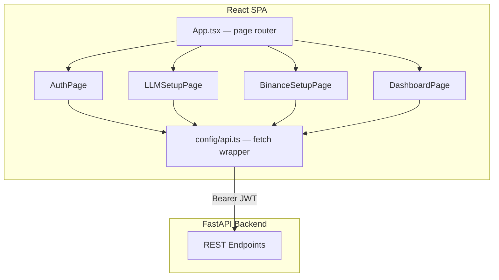
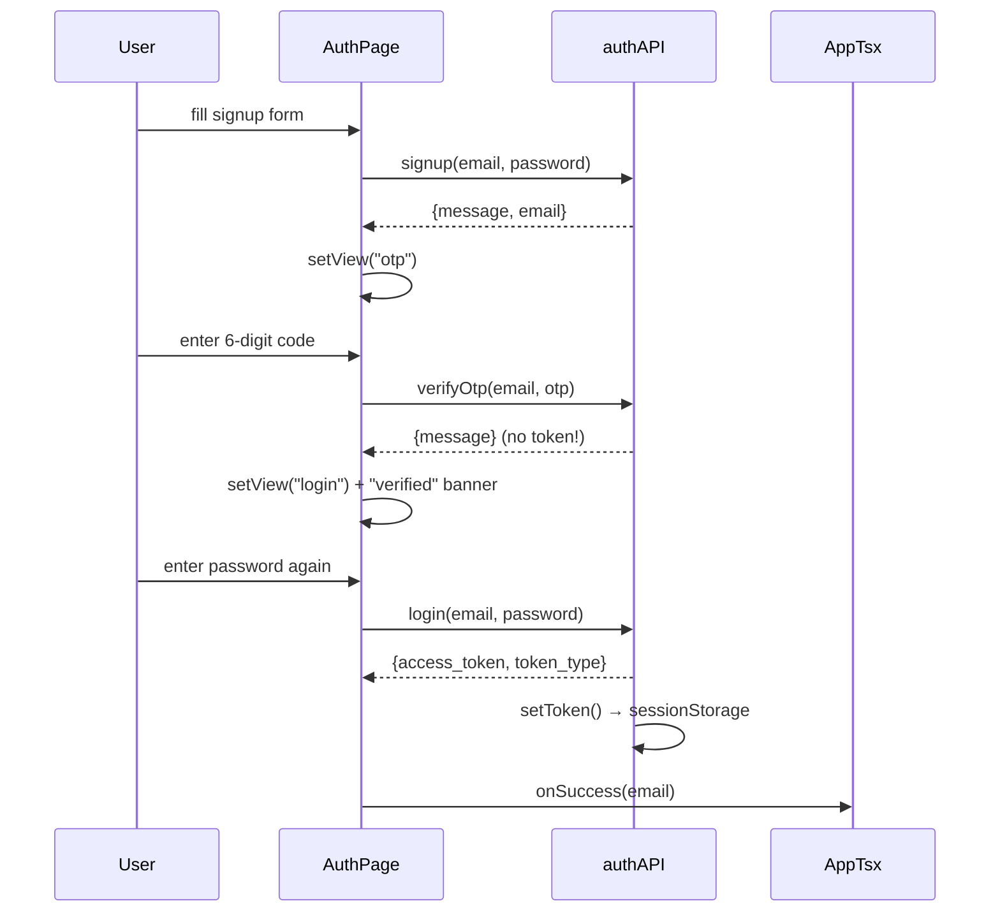

# Krypton — AI Crypto Trading Assistant (Frontend)

A React + TypeScript single-page app that walks a user through OTP-verified signup, BYO-LLM key setup, optional Binance connection, and then into a live trading dashboard powered entirely by the FastAPI backend.

---

## Table of Contents
- [Architecture Overview](#architecture-overview)
- [Tech Stack](#tech-stack)
- [Folder Structure](#folder-structure)
- [App-Level Routing (State Machine)](#app-level-routing-state-machine)
- [The `api.ts` Client Layer](#the-apits-client-layer)
- [Pages](#pages)
- [Auth Flow in Detail](#auth-flow-in-detail)
- [Setup & Configuration](#setup--configuration)
- [Running the App](#running-the-app)
- [Design Principles Recap](#design-principles-recap)

---

## Architecture Overview

The frontend has **no client-side state of its own beyond UI state**. It never stores an LLM key, a Binance secret, or a user record — every one of those lives encrypted on the backend. The frontend's job is:

1. Collect input (email/password, OTP digits, provider/model/key, symbol/timeframe).
2. Send it to the matching FastAPI endpoint via `config/api.ts`.
3. Render whatever status/data comes back.



**Key rule:** components never call `fetch()` directly — every network call goes through the typed functions exported from `config/api.ts`, which centralizes the base URL, auth header, timeout, and 401 handling in one place.

---

## Tech Stack

| Concern | Choice | Why |
|---|---|---|
| Framework | React 18 + TypeScript | Type-safe component tree matching the backend's Pydantic schemas |
| Bundler/dev server | Vite | Fast HMR, `import.meta.env` for config |
| Styling | Tailwind CSS (utility classes, CSS-variable theme) | `bg-background`, `text-foreground`, `border-border` etc. map to a dark, terminal-inspired design token set |
| Animation | `motion/react` (Framer Motion) | Page transitions, shake-on-error, staggered reveals |
| Icons | `lucide-react` | Lightweight, tree-shakeable icon set |
| Auth storage | `sessionStorage` | Token cleared on tab close — smaller XSS blast radius than `localStorage`; not as strong as an httpOnly cookie, but a reasonable middle ground |

---

## Folder Structure

```
src/
├── config/
│   └── api.ts              # Single source of truth for every backend call
├── pages/
│   ├── App.tsx              # Top-level page router / state machine
│   ├── AuthPage.tsx          # Login / Signup / OTP verify (3 views, 1 component)
│   ├── LLMSetupPage.tsx      # Provider + model + API key entry
│   ├── BinanceSetupPage.tsx  # Optional exchange key entry
│   └── DashboardPage.tsx     # Live indicators, news, risk, agent chat
```

There is deliberately **no `store/` or global state library** (Redux, Zustand, etc.). `App.tsx` holds the only cross-page state (`email`, `onboarding` status), and every other page fetches what it needs on mount.

---

## App-Level Routing (State Machine)

`App.tsx` doesn't use a router library — it's a plain `useState<Page>` switch, because the flow is strictly linear and gated by backend status, not by arbitrary URLs.

```mermaid
stateDiagram-v2
    [*] --> loading
    loading --> auth: no token found
    loading --> dashboard: token valid + llm_key_set
    loading --> llm-setup: token valid + no llm key
    auth --> llm-setup: login/signup success + no llm key
    auth --> dashboard: login success + llm key already set
    llm-setup --> binance-setup: key saved
    binance-setup --> dashboard: connected OR skipped
```

On mount, `App.tsx` calls `GET /status/onboarding` if a token already exists (e.g. the tab was refreshed) and routes straight to the correct screen — a returning user with a valid key never sees the setup screens again.

```ts
// App.tsx (bootstrap)
useEffect(() => {
  async function bootstrap() {
    if (!getToken()) { setPage("auth"); return; }
    try {
      const onboarding = await statusAPI.getOnboarding();
      setPage(onboarding.llm_key_set ? "dashboard" : "llm-setup");
    } catch {
      setPage("auth"); // apiFetch already cleared the invalid/expired token
    }
  }
  bootstrap();
}, []);
```

Binance is **optional at every step** — both a successful connect and an explicit "Skip" from `BinanceSetupPage` lead to the same `dashboard` state.

---

## The `api.ts` Client Layer

Everything the frontend knows about the backend lives in one file: `config/api.ts`. A few deliberate choices:

- **Field names match the backend's JSON exactly** (`access_token`, `is_valid`, `overall_risk_score`, …) rather than being translated to camelCase — one less place for a silent mismatch bug to hide.
- **A single `apiFetch<T>()` wrapper** handles the base URL, `Content-Type`, `Authorization: Bearer <token>` header, a 10s timeout via `AbortController`, and a global 401 handler that clears the token and redirects to `/login`.
- **No key material ever round-trips.** `llmKeyAPI.setKey()` and `binanceAPI.connect()` send a key *in*, but every corresponding `getStatus()` call only returns booleans (`is_valid`, `is_active`) — the backend encrypts at rest and never sends it back out.
- **404 is treated as a legitimate, expected state**, not an error, in two places: `llmKeyAPI.getStatus()` (no key set yet) and `binanceAPI.getStatus()` / `riskAPI.getProfile()` (Binance not connected yet). Both return `null` instead of throwing, so pages can render an upsell/empty state instead of an error boundary.

```
authAPI        → signup, verifyOtp, resendOtp, login, logout
statusAPI      → getOnboarding
llmKeyAPI      → setKey, getStatus
binanceAPI     → connect, getStatus, getPortfolio
chartContextAPI→ get, set
marketAPI      → getIndicators
newsAPI        → getFeed
riskAPI        → getProfile
agentAPI       → chat, strategy
```

`agentAPI.chat` / `agentAPI.strategy` take **no LLM config** — the backend already has the user's encrypted key and current chart context stored server-side, so the frontend only ever sends the question itself (or nothing, for `/strategy`).

---

## Pages

### `AuthPage`
Three views in one component (`login` / `signup` / `otp`), animated with `AnimatePresence`. See [Auth Flow in Detail](#auth-flow-in-detail) below.

### `LLMSetupPage`
Presents provider cards (OpenAI / Groq / Gemini / Claude), a model picker per provider, and an API key field. Calls `llmKeyAPI.setKey()` directly and reports success via `onNext()` — no config object is threaded back up to `App.tsx`, since the key already lives encrypted on the backend the moment the call resolves.

### `BinanceSetupPage`
Optional. Calls `binanceAPI.connect(apiKey, apiSecret)`, which validates against Binance immediately and returns `is_valid` in the same response — there's no separate "test connection" step. Offers both `onNext` (connected) and `onSkip` (deferred), both routing to the dashboard.

### `DashboardPage`
Fetches everything itself on mount — indicators, news feed, risk profile, and agent responses — directly from the backend. Receives only `email` as a prop, purely for a "Signed in as …" display; it does not receive any config or key material from `App.tsx`.

---

## Auth Flow in Detail

`AuthPage` intentionally does **not** call `onSuccess` after OTP verification — the backend's `/auth/verify-otp` only flips `is_verified`, it doesn't issue a token. So the flow is:



`onSuccess: (email: string) => void` is the only thing `AuthPage` hands back up — `App.tsx` uses the email for display and immediately calls `statusAPI.getOnboarding()` itself to decide whether to route to `llm-setup` or straight to `dashboard` (a returning user who already has a key configured skips setup entirely).

---

## Setup & Configuration

### 1. Install dependencies
```bash
npm install
```

### 2. Configure the API base URL
Create a `.env` (or `.env.local`) file:

```bash
VITE_API_BASE_URL=http://127.0.0.1:8000
```

If unset, `config/api.ts` defaults to `http://127.0.0.1:8000`, matching the backend's default `uvicorn` port.

### 3. Backend must be running
This frontend has no mock/offline mode — every page except the very first paint of `AuthPage` depends on a live backend. Start the backend first (see the backend README's [Running the App](#) section).

---

## Running the App

```bash
npm run dev
```

- Dev server: `http://localhost:5173` (default Vite port)
- Requires the backend reachable at `VITE_API_BASE_URL`, with CORS configured to allow the dev origin.

---

## Design Principles Recap

1. **One typed API client, zero raw `fetch()` calls in components.** Every backend interaction goes through `config/api.ts`.
2. **No secrets, ever, in frontend state.** LLM keys and Binance secrets are write-only from the frontend's perspective — sent once, never read back.
3. **Status, not config, drives the UI.** Pages ask "is a key set / valid / connected?" rather than holding onto the actual credentials.
4. **Optional steps never block the app.** Binance is skippable at every level, both in the UI and in how the backend's `risk_node` degrades gracefully when it's absent.
5. **`sessionStorage` + a global 401 handler** means token expiry is handled once, centrally, instead of being re-implemented on every page that calls the API.